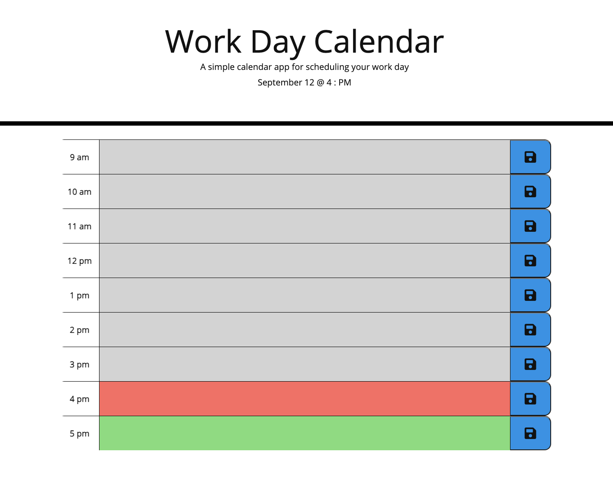

# Work Day Calendar :hourglass_flowing_sand:

## Description
This Calendar can be used to help manage you day for standard business hours, 9am-5pm.

### Features

- Date at top of the page updates.
- Enter text in area to schedule your day by the hour.
- Click the save button to commit your text to local storage.
- Your text will persist, after refreshing the page. (if you clicked the save button)
- The hours are color-coded according to; past, present, future.

## Link

[Live Website](https://nicwille.github.io/work-day-calendar/)
- Made possible by Github Pages.

## Technologies Used

1. HTML
1. CSS
1. Javascript
1. APIs and Libraries
    - jQuery
    - DOM API
    - Day.js
    - Font Awesome
    - Bootstrap

## Screenshot

